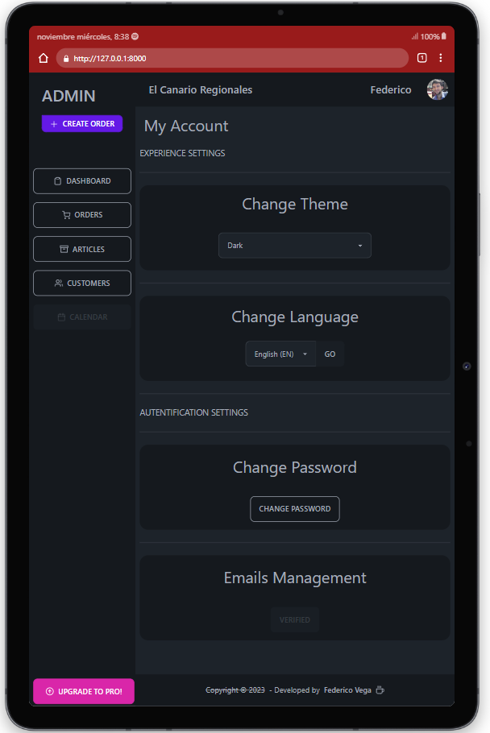
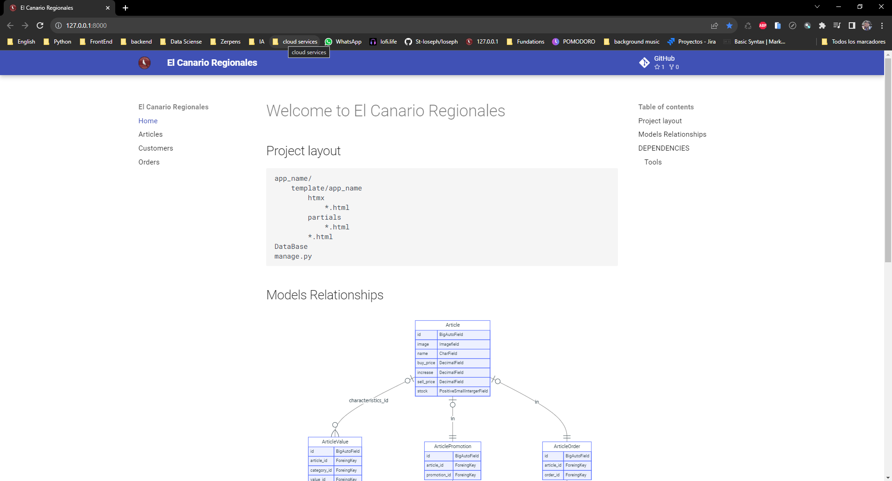
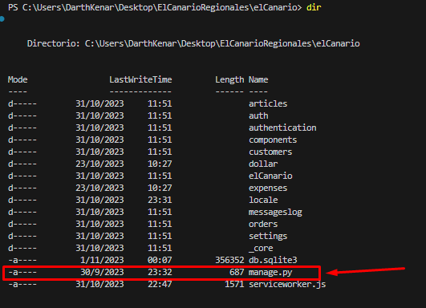
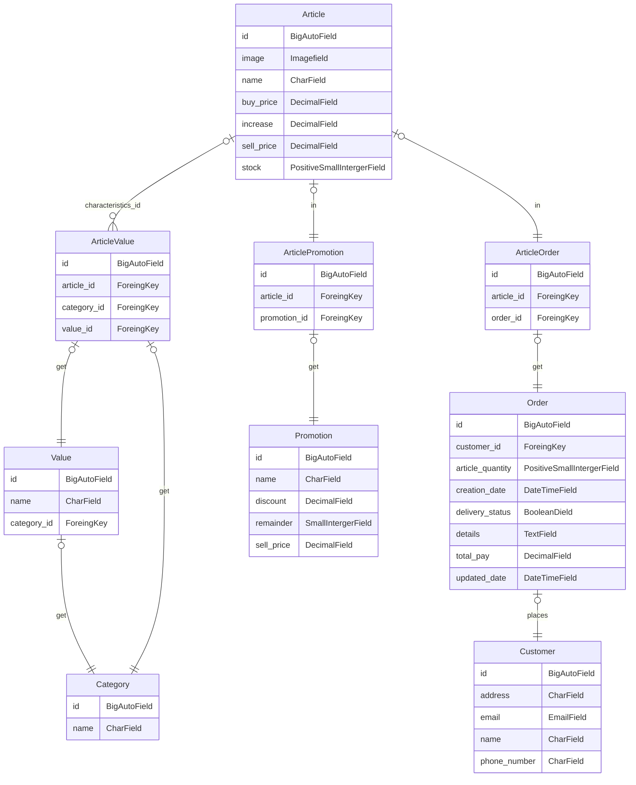

[Documentación en Español][Spanish] <--

# Goal

> Web application to control Stock, Customers and Orders for a small business.
> 
---

## PREVIEW

### RESPONSIVE DESIGN



### CHANGE LANGUAGE


### CHANGE THEME


#### Features

- Create, edit, delete _customers_.
- Creates, edits, deletes _items_ for articles
  - Creates, edits or deletes _categories_ for articles
    - Creates, edits or deletes _values_ related to a specific category (to relate them to a specific article)
- Create, edit, delete _orders_.
- Automatic creation of log of actions displayed on the main panel (desktop)
- Full authentication system
  - Login (or register) with Google account
  - Registration
  - Login with Google account
  - Password recovery
  - Email confirmation (not mandatory for practical purposes)
  - Dual authentication system (2FA) (not mandatory for practical purposes)
  - and much more...
- Filtering of Cards (objects [Customers, Orders, Items]) based on any of their attributes (Implemented HTMX dynamic page)
- Install the application on your cell phone (Progressive web application)

## Getting started

## With python installed

[Download Python](https://www.python.org/downloads/release/python-3120/)

### Clone repository

```bash
git clone https://github.com/DarthKenar/ElCanarioRegionales.git
```

#### Full Online Technical Documantation

[Documentation Link](https://darthkenar.github.io/ElCanarioRegionales/)

#### Full offline Technical Documentation

#### Install mkdocs to view the complete project documentation in local server

```bash
pip install mkdocs
```

#### In the current project directory run documet server

```bash
mkdocs serve
```



---

### RUN APLICATION

---

#### > To run the application with PDM

##### If you do not have pdm

```bash
pip install pdm
```

##### If you have pdm or once you have it

#### Install the dependencies in the virtual environment

```bash
pdm install
```

#### Performs migrations to use a local database

```bash
pdm migrate
```

#### Run Server

```bash
pdm server
```

---

#### > To run the application with PIP, create a virtual enviroment

```bash
py -m venv enviroment_name
```

#### Activates the virtual environment

```bash
source enviroment_name/bin/activate
```

#### In the activated virtual environment install requirements

```bash
pip install -r requirements.txt
```

#### With the dependencies already installed we go to the folder containing the python manage file

```bash
cd ElCanarioRegionales
cd elCanario
```

#### We check that the directory contains the python manage file

```bash
cd dir
```



#### We perform the migrations to use a local database

```bash
py manage.py migrate
```

#### We run our local server

```bash
py manage.py runserver
```

---

#### NOTA

> If a local server is used, the google login function will not be available because the google credentials are not available.
> For more information: [Google credentials](https://console.cloud.google.com/apis/credentials)

---

## Diagrama de Modelos



[Spanish]: /docs/README-ES.md