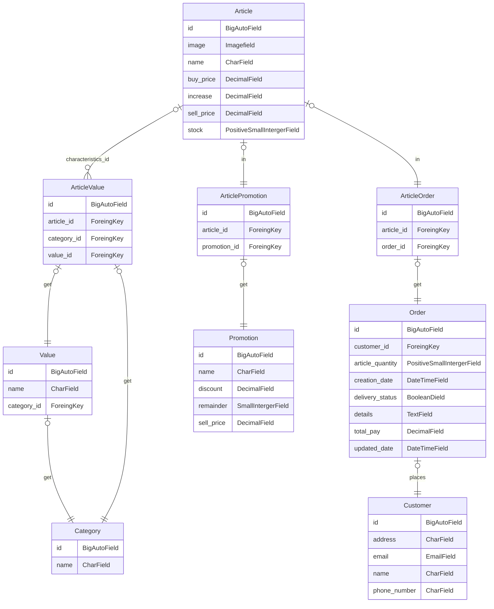

[Volver][volver]


#### Documentacion Técnica Online Completa

[Documentation Link](https://darthkenar.github.io/ElCanarioRegionales/)

# Objetivo

## Description

Originalmente la aplicacion web El Canario Regionales fue creada para la gestion de un pequeño negocio de artículos regionales argentinos ([@elcanario.regionales](https://www.instagram.com/elcanario.regionales/)), aunque su uso puede ser general para cualquier negocio ABM.
Dada su naturaleza y escalabilidad sería cuestion de reemplazar logotipos, tipografias y algunas otras pequeñas cosas.
Al usar DaisyUI esto se vuelve muy sencillo.

## PRESENTACIÓN

### DISEÑO RESPONSIVE


### CAMBIA DE IDIOMA


### CAMBIA DE TEMA


#### Funcionalidades

- Crea, edita, elimina _clientes_
- Crea, edita, elimina _artículos_
  - Crea, edita o elimina _categorías_ para artículos
    - Crea, edita o elimina _valores_ relacionados con una categoría específica (para relacionarlos con un artículo específico)
- Crea, edita, elimina _ordenes_
- Creacion automática de registro de acciones mostradas en el panel principal (escritorio)
- Sistema de autentificación completo
  - Inicio de sesión (o registro) con cuenta de Google
  - Registro
  - Inicio de sesión
  - Recuperacion de contraseña
  - Confirmación de e-mails (no obligatorio a fines practicos)
  - Sistema de doble autentificacion (2FA) (no obligatorio a fines practicos)
  - y mucho más...
- Filtrado de Cartas (objetos [Clientes, Ordenes, Artículos]) en base a cualquiera de sus atributos (Implementado HTMX pagina dinámica)
- Instala la aplicacion en tu celular (Aplicación web progresiva)

## Primeros pasos

## Con python instalado

[Download Python](https://www.python.org/downloads/release/python-3120/)

### Clonar proyecto

```bash
git clone https://github.com/DarthKenar/ElCanarioRegionales.git
```

#### Instala mkdocs para visualizar la documentacion completa del proyecto

```bash
pip install mkdocs
```

#### En el directorio actual del proyecto ejecuta

```bash
mkdocs serve
```


---

#### > Para ejecutar la aplicacion con PDM

##### Si no tienes pdm (instálalo)

```bash
pip install pdm
```

##### Si tienes pdm o una vez que lo tengas

#### Instala las dependencias en el entorno virtual

```bash
pdm install
```

#### Realiza las migraciones para utilizar una base de datos local

```bash
pdm migrate
```

#### Ejecuta el servidor

```bash
pdm server
```

---

#### > Para ejecutar la aplicacion con PIP, primero creamos un entorno virtual

```bash
py -m venv nombre_del_entorno
```

#### Activa el entorno virtual

```bash
source nombre_del_entorno/bin/activate
```

#### En el entorno virtual activado

```bash
pip install -r requirements.txt
```

#### Con las dependencias ya instaladas nos dirigimos a la carpeta que contiene el archivo python manage

```bash
cd ElCanarioRegionales
cd elCanario
```

#### Comprobamos que en el directorio se encuentre el archivo python manage

```bash
cd dir
```


#### Realizamos las migraciones para utilizar una base de datos local con

```bash
py manage.py migrate
```

#### Ejecutamos nuestro servidor local con

```bash
py manage.py runserver
```

---

#### NOTA

> Si se utiliza un servidor local la funcion de logear con google no estará disponible por no tener disponibles las credenciales de google
> Para más información: [Credenciales de Google](https://console.cloud.google.com/apis/credentials)

---

## Diagrama de Modelos



[Volver][volver]

[volver]: /README.md
