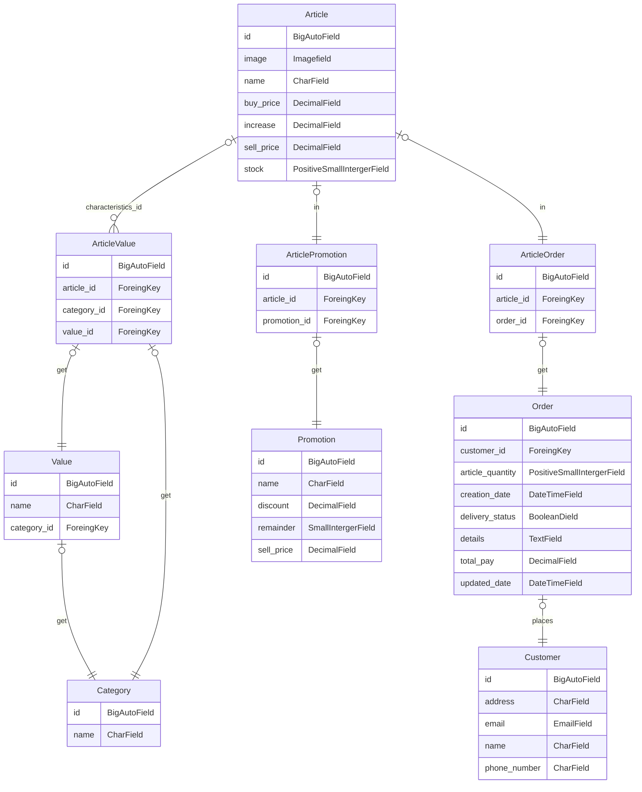

# Welcome to El Canario Regionales


## Description

[@elcanario.regionales](https://www.instagram.com/elcanario.regionales/)

## Features

- Create, edit, delete _customers_.
- Creates, edits, deletes _items_ for articles
  - Creates, edits or deletes _categories_ for articles
    - Creates, edits or deletes _values_ related to a specific category (to relate them to a specific article)
- Create, edit, delete _orders_.
- Automatic creation of log of actions displayed on the main panel (desktop)
- Full authentication system
  - Login (or register) with Google account
  - Registration
  - Login with Google account
  - Password recovery
  - Email confirmation (not mandatory for practical purposes)
  - Dual authentication system (2FA) (not mandatory for practical purposes)
  - and much more...
- Filtering of Cards (objects [Customers, Orders, Items]) based on any of their attributes (Implemented HTMX dynamic page)
- Install the application on your cell phone (Progressive web application)

## Project layout

``` bash

app_name/
    template/app_name
        htmx
            *.html
        partials
            *.html
        *.html
DataBase
manage.py
```

## Models Relationships



---

## DEPENDENCIES

| Package | Description | Link |
| ----------- | ---|---|
| "django>=4.2.6" | Web framekork | [Django](https://www.djangoproject.com/) |
| "django-allauth>=0.58.1" | Social Authentication |[django-allauth](https://github.com/pennersr/django-allauth)|
| "django-pwa>=1.1.0" | Aplicación Web Progresiva | [django-pwa](https://github.com/silviolleite/django-pwa) |
| "django-widget-tweaks>=1.5.0" | Form Render | [django-widget-tweaks](https://github.com/jazzband/django-widget-tweaks) |
| "slippers>=0.6.2" |Components whit template tags| [slippers](https://github.com/mixxorz/slippers) |
| "Pillow>=10.1.0" ||[Pillow](https://github.com/python-pillow/Pillow)|
| "pytz>=2023.3.post1" ||[pytz](https://github.com/stub42/pytz)|

### Tools

- [TailWinds](https://tailwindcss.com/)
- [DaisyUI](https://daisyui.com/)
- [Feathericons](https://feathericons.com/)
- [HTMX](https://htmx.org/)

## PREVIEW

### RESPONSIVE DESIGN


### CHANGE LANGUAGE


### CHANGE THEME


